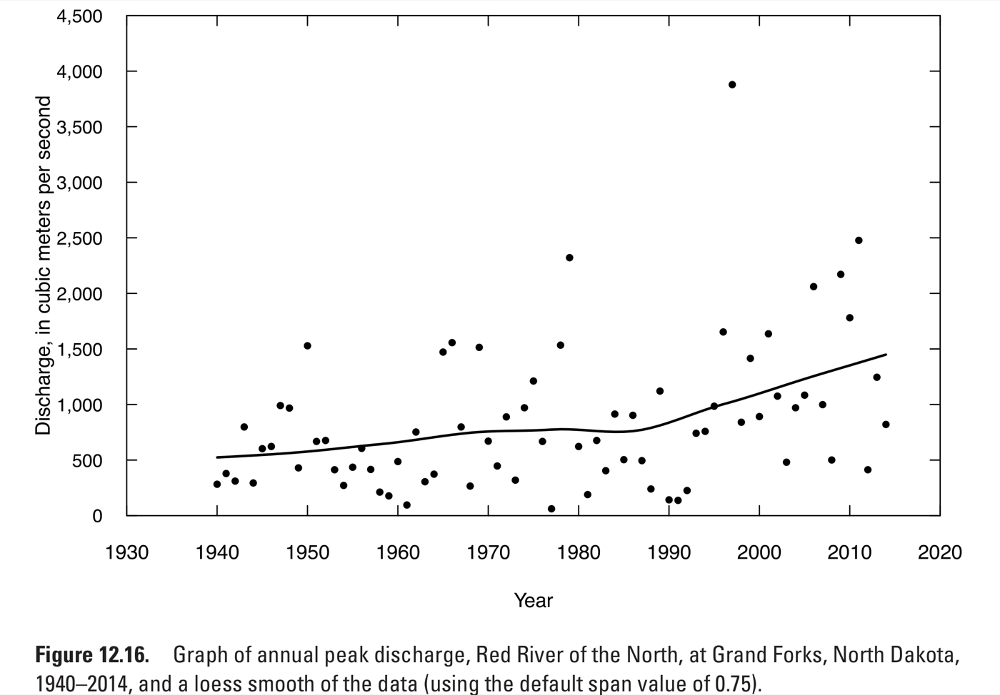
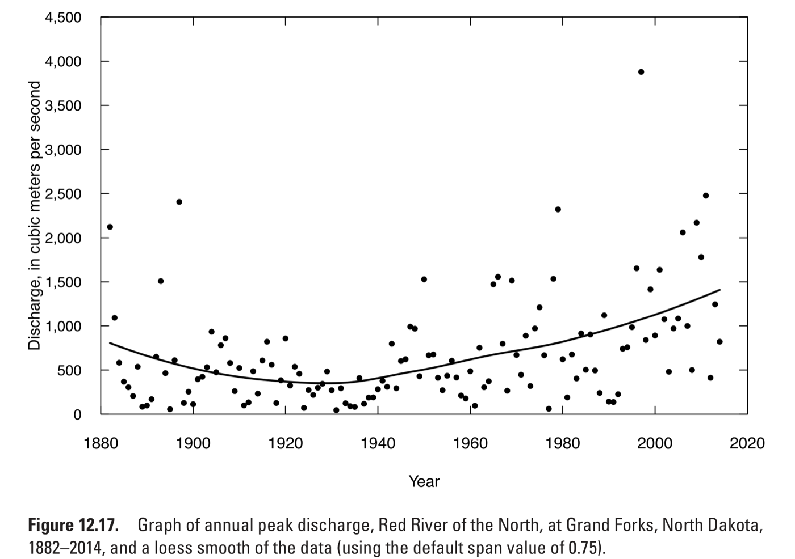

We will work on these questions in class Wednesday.

## Choosing a covariate for a future design

An analyst models annual maximum daily rainfall $Y_t$ as a GEV whose location depends on a covariate $X_t$:

$$
Y_t \mid X_t \sim \text{GEV}(\mu_0 + \mu_1 X_t, \sigma, \xi)
$$

They fit the model four times, each with a different $X_t$:

- the winter Niño 3.4 index, a measure of El Niño;
- the natural log of atmospheric CO2;
- the average summer temperature at the station;
- the year.

a.
What does $\mu_1$ measure, and what does $\mu_1 = 0$ say about rainfall?

::: {.answer}
$\mu_1$ is how much the location of the annual maximum shifts for each unit increase in $X_t$.
If $\mu_1 = 0$, the distribution does not depend on $X_t$, and the model is an ordinary stationary GEV.
:::

b.
Take $X_t$ to be Niño 3.4, and suppose $\mu_1 > 0$.
Given the index in each year, do all years have the same distribution of rainfall?

::: {.answer}
No.
Given $X_t$, a year with a high index has a location of $\mu_0 + \mu_1 X_t$, larger than a year with a low index, so each year has its own distribution.
The years are independent given $X_t$ but not identically distributed.
:::

A county asks for the 100-year daily rainfall in 2070, which requires the value of $X_{2070}$.

c.
For which covariate is $X_{2070}$ known exactly?

::: {.answer}
The year: $X_{2070} = 2070$.
:::

d.
Order the four covariates from the most to the least uncertain value of $X_{2070}$, and give the reason for each position.

::: {.answer}
From most to least uncertain:

1. **Niño 3.4.** It cannot be predicted more than about a season ahead, so for 2070 the analyst knows only its distribution, not its value.
1. **Local summer temperature.** It needs an emissions scenario, then a climate model to turn the scenario into warming, then the local year-to-year variation on top of that.
1. **Log CO2.** Given an emissions scenario it is set, so the only uncertainty is which scenario happens.
1. **Year.** Known exactly.
:::

## One large value in a trend test

Two versions of a six-year record differ in one value [@helsel_waterresources:2020]:

| $t$ | 1 | 2 | 3 | 4 | 5 | 6 |
| :--- | ---: | ---: | ---: | ---: | ---: | ---: |
| Record A | 10 | 40 | 30 | 55 | 62 | 56 |
| Record B | 10 | 40 | 30 | 55 | 200 | 56 |

The Mann-Kendall test and the regression slope test give:

| | Mann-Kendall $S$ | Mann-Kendall $p$ | Regression slope | Regression $p$ |
| :--- | ---: | ---: | ---: | ---: |
| Record A | 11 | 0.039 | 9.2 per year | 0.024 |
| Record B | 11 | 0.039 | 21 per year | 0.23 |

a.
Which test's result changed?

::: {.answer}
The regression slope test.
The slope more than doubled and the $p$-value went from 0.024 to 0.23, while Mann-Kendall's $S$ and $p$ are the same.
:::

b.
Why did $S$ stay the same?

::: {.answer}
$S$ counts pairs where the later value is larger, minus pairs where it is smaller.
The value in year 5 is larger than every earlier value and larger than year 6 whether it is 62 or 200, so no pair changes its order.
:::

c.
Houston Hobby's record includes Hurricane Harvey, a single day far above any other.
Which test's result depends less on how large that one day was?

::: {.answer}
Mann-Kendall, because it uses only the order of the values.
Making Harvey larger or smaller, as long as it stays the largest, leaves $S$ unchanged; the regression slope moves with it.
:::

## Trend or oscillation

The figures show annual peak discharge of the Red River of the North at Grand Forks, North Dakota, first for 1940-2014 and then for the full record, 1882-2014 [@helsel_waterresources:2020].
The curve through the points follows the average of nearby years.
The figures are from the U.S. Geological Survey and are in the public domain.

{width=80%}

{width=80%}

Both periods reject the null hypothesis of no trend:

| Period | Years | Mann-Kendall $p$ | Regression slope (m³/s per year) |
| :--- | ---: | ---: | ---: |
| 1940-2014 | 75 | 0.0007 | 11.6 |
| 1882-2014 | 133 | 0.000006 | 5.5 |

Answer each part yes or no, and give the reason.

a.
Does the rejection on 1940-2014 show that peak flows rose along a straight line?

::: {.answer}
No.
Mann-Kendall tests only whether later years tend to be larger than earlier ones.
A straight line, a step, part of a slow oscillation, or wet and dry decades with no trend could each produce a rejection.
:::

b.
Suppose you fit a straight line to 1940-2014 and run it backward.
Would it match the peaks of the 1880s and 1890s?

::: {.answer}
No.
The fitted line is at about 410 m³/s in 1940 and falls 11.6 m³/s for every year earlier, so by 1885 it is below zero, a negative flow.
The 1880s and 1890s had peaks near 2,100 and 2,400 m³/s.
:::

c.
Both tests assume independent years.
If the river has wet decades and dry decades, are the $p$-values in the table too small?

::: {.answer}
Yes.
Wet and dry decades make long runs of high or low years likely without any trend, and a test that assumes independent years reads those runs as a trend.
:::

## Reading a nonstationary GEV

Two GEV models are fit to 80 years of Houston Hobby annual maximum daily rainfall (1940-2025).
Both put a straight-line trend in the location and keep the scale and shape fixed.

The **trend in log CO2** model uses $c_t$, the natural log of atmospheric CO2 in parts per million in year $t$:

$$
Y_t \sim \text{GEV}(\mu_0 + \mu_1 c_t, \sigma, \xi)
$$

with $\hat\mu_0 = -59.3$ mm, $\hat\mu_1 = 25.6$ mm, $\hat\sigma = 34.5$ mm, and $\hat\xi = 0.19$.

The **trend in year** model uses the year $t$ itself:

$$
Y_t \sim \text{GEV}(\beta_0 + \beta_1 t, \sigma, \xi)
$$

with $\hat\beta_0 = -128.1$ mm, $\hat\beta_1 = 0.110$ mm per year, and the same $\hat\sigma$ and $\hat\xi$ to the digits shown.

The two fits have almost the same log likelihood.
Their locations and 100-year levels are:

| | 1950 | 2025 | 2070, 500 ppm | 2070, 600 ppm |
| :--- | ---: | ---: | ---: | ---: |
| Location, trend in log CO2 (mm) | 87.7 | 95.8 | 99.8 | 104.5 |
| 100-year level, trend in log CO2 (mm) | 341.3 | 349.3 | 353.4 | 358.0 |
| 100-year level, trend in year (mm) | 340.6 | 348.8 | 353.8 | 353.8 |

a.
In the model with a trend in log CO2, the 100-year level minus the location is about 253.5 mm in every column.
Why?

::: {.answer}
Only the location carries the trend; $\sigma$ and $\xi$ are the same every year.
The distribution slides up as CO2 rises without changing its shape, so every quantile moves by the same amount as the location.
:::

b.
Why do the two models fit the record almost equally well?

::: {.answer}
Over 1940-2025, year and log CO2 rose together, so a line in one is nearly a line in the other.
The record cannot tell them apart.
:::

c.
Which model's 2070 value depends on the emissions scenario?

::: {.answer}
The model with a trend in log CO2, which gives 353.4 mm at 500 ppm and 358.0 mm at 600 ppm.
The model with a trend in year gives 353.8 mm under every scenario, because 2070 is 2070 whatever happens to emissions.
:::

## Risk over a mortgage with a rising flood chance

A house is bought with a 30-year mortgage.
In the first year, the chance that floodwater reaches it is 1%.
That chance rises in a straight line to 2% in year 30.
Flooding in different years is independent.

| Yearly chance | Chance of at least one flood in 30 years |
| :--- | ---: |
| 1% every year | 26.0% |
| 1% rising to 2% | 36.5% |
| 1.50% every year | 36.5% |

a.
The flood map shows the house at the 1-percent flood level, drawn from this year's chance.
Is the homeowner's risk over the mortgage higher than 26%?

::: {.answer}
Yes, 36.5%.
The map uses this year's 1%, and every later year has a higher chance.
:::

b.
Which of Monday's three definitions of the 1-percent flood does the map use?

::: {.answer}
The level today: the flood with a 1% chance this year.
:::

c.
Is 1.50%, the steady chance with the same 30-year risk, close to the average of the thirty yearly chances?

::: {.answer}
Yes.
The yearly chances average 1.5%.
When a yearly chance $p$ is small, the chance of no flood that year, $1 - p$, is close to $e^{-p}$.
The chance of no flood in 30 years is then close to $e^{-(p_1 + \cdots + p_{30})}$, which depends only on the sum of the yearly chances, so the steady chance with the same sum, their average, gives nearly the same risk.
:::
