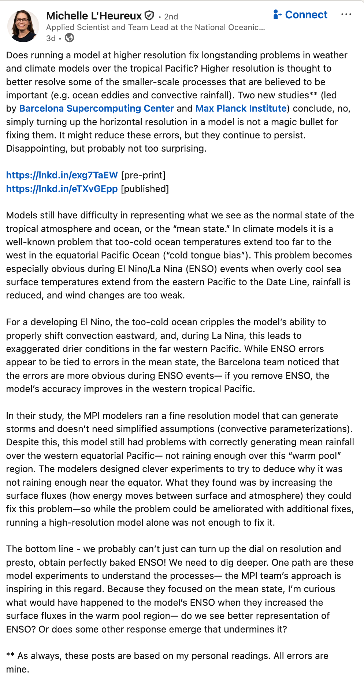
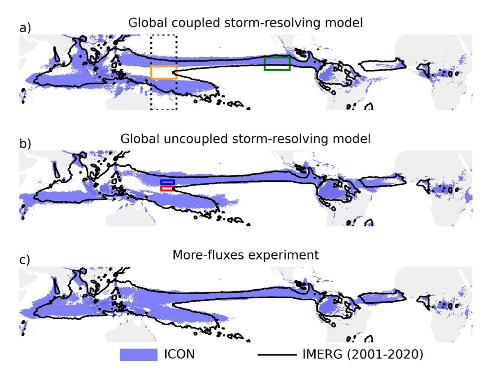

## Reflecting on Module 1 {.smaller}

::: {.callout-tip .fragment}
## Think-pair-share (2 minutes)

What are potential limitations of GEV and nonstationary GEV methods for climate risk assessment?
:::

::: {.fragment}
**Key limitations:**

- Require long observational records (often unavailable)
- Parametric representation of nonstationarity
- Events with multiple drivers create multimodal distributions
- Model structure uncertainty
:::

::: {.fragment}
**Module 2 addresses these using climate model output.**
:::

# Logistics

## Problem Set 2

Due **Wednesday, November 19th**.

Topics:

- Climate model simulations
- Statistical downscaling
- Bias correction

Focus on practice problems for exam preparation.

## Proposed Syllabus Update

**Proposal:** Remove final exam, redistribute points.

::: {.columns}
::: {.column width="50%"}
### Current

- Problem sets: 10%
- Labs: 10%
- Module tests: 40%
- Final project: 20%
- Final exam: 20%
:::
::: {.column width="50%"}
### Proposed

- Problem sets: 15%
- Labs: 15%
- Module tests: 50%
- Final project: 20%
:::
:::

## Module 2 Structure

Three-part weekly rhythm:

1. **Method Lecture** - Statistical/computational methods
2. **Paper Discussion** - Research paper applying these methods
3. **Lab** - Hands-on Julia implementation

## Module 2 Schedule {.smaller}

| Week | Method | Paper | Lab |
|------|--------|-------|-----|
| Oct 20-24 | Bias Correction | TBD | Lab 7 |
| Oct 27-31 | Weather Typing | TBD | Lab 8 |
| Nov 3-7 | HMMs | TBD | Lab 9 |
| Nov 10-14 | Weather Generators | TBD | Lab 10 |
| Nov 17-21 | Sensitivity Analysis | TBD | Exam |

Papers announced one week ahead.

# Climate Risks and Variability

## Climate Risks Cluster {.smaller}

::: {.fragment}
Spatial clustering → portfolio risk.
Temporal clustering → insurance/reinsurance viability.
:::

![Time series of the yearly number of 30-day extreme rainfall events exceeding the 10-year return level for the Rio Tinto portfolio computed using the 20CR dataset, using 3 windows (11, 21, and 114 years) to illustrate different aspects of long-term variability [@bonnafous_waterrisk:2017]](bonnafous-2017-hess-fig-4.png)

## Climate Risks Vary on Many Timescales {.smaller}

::: {.fragment}
Multi-timescale variability is essential for design and planning.
:::

![Global wavelet analysis of two (L) living Blended Drought Analysis and (B) Naturalized American River at Folsom [@doss-gollin_robustadaptation:2019]](doss-gollin-ef-2019.png)

::: {.notes}
From daily weather to multi-decadal variability:

- Daily to weekly: individual storms
- Seasonal: ENSO, monsoons
- Interannual to decadal: PDO, AMO
- Multi-decadal to centennial: climate change
:::

## Nonlinear Dynamics {.smaller}

![(a) Segment of the jet stream latitude time series corresponding to the first ten winters: DJF 1957/1967. (b) Trajectory of the winter jet latitude time series in delay coordinates using a 10-day lag. (c) Histogram and PDFs of the jet stream latitude anomaly using a kernel density estimate (solid) and a three-component Gaussian mixture model (dashed). In (b) and (c) the whole time series (DJF 1957–2002) was used. [@hannachi_jetstream:2011]](hannachi-2011-fig2.jpg)

# Climate Models Overview

## What is a Climate Model?

::: {.fragment}
Numerical solution of PDEs on global grids.
:::

::: {.callout-tip .fragment}
## Think-pair-share (1 minute)

What equations do climate models solve?
:::

## Weather vs Climate {.smaller}

::: {.fragment}
**Weather (IVP):**

- Specific atmospheric states
- Days to weeks
- Sensitive to initial conditions
:::

::: {.fragment}
**Climate (BVP):**

- Long-term statistics
- Decades to centuries
- Forced by boundary conditions
:::

## AI/ML Models

::: {.fragment}
Recent developments:

- GraphCast, FourCastNet, Pangu-Weather, Aurora
- Data-driven vs. physics-based
- Fast inference, competitive weather skill
:::

::: {.callout-note .fragment}
## Discussion

What are the advantages and limitations of AI vs. physics-based models?
:::

## History

::: {.fragment}
Milestones:

- 1967: Manabe & Wetherald - first GCM with doubled CO$_2$
- 1990s-present: CMIP coordination
- Evolution: energy balance $\rightarrow$ GCMs $\rightarrow$ ESMs
:::

::: {.callout-note .fragment}
## Discussion

Do you have experience with climate model output?
:::

## CMIP6

::: {.fragment}
Coordinated international effort:

- Standardized experiments across centers
- Model evaluation and comparison
- IPCC assessment support
- Climate impacts research
:::

::: {.fragment}
100+ models from ~50 institutions.
:::

## CMIP6 Experiments {.smaller}

::: {.fragment}
**Historical (1850-2014):**

- Observed forcings
- Model evaluation
:::

::: {.fragment}
**SSPs (future scenarios):**

- SSP1-1.9 through SSP5-8.5
- Different emissions paths
- "What if" scenarios, not predictions
:::

::: {.fragment}
**Detection & Attribution:**

- Isolate forcing factors
:::

## Why Ensembles?

::: {.fragment}
Multiple realizations separate:

- Internal variability
- Forced response
- Projection uncertainty
:::

::: {.callout-note .fragment}
## Discussion

Why run ensembles for identical scenarios?
:::

# Model Limitations and the Need for Statistical Methods

## Coarse Resolution {.smaller}

::: {.columns}
::: {.column width="70%"}
::: {.fragment}
- CMIP6 models don't resolve tropical cyclones, mesoscale convection, etc.
:::

::: {.fragment}
- Sub-grid processes **always** require parameterization.
:::
:::
::: {.column width="30%"}

:::
:::

## Systematic Biases {.smaller}

::: {.columns}
::: {.column width="50%"}

:::
::: {.column width="50%"}

:::
:::

## Discussion: Model Limitations vs. Value {.smaller}

::: {.callout-tip}
## Think-pair-share (3 minutes)

Suppose you are analyzing extreme rainfall in a region where rainfall is strongly modulated by ENSO, but climate models struggle to accurately simulate ENSO dynamics.

Should you use the model simulations for your analysis?
What factors would influence your decision?
:::

::: {.fragment}
**Key considerations:**

- What specific information do you need from the models?
- Can you bias-correct or statistically adjust for ENSO biases?
- Are there alternative approaches (e.g., weather typing, conditional sampling)?
- What are the consequences of getting it wrong?
:::

## References

::: {#refs}
:::