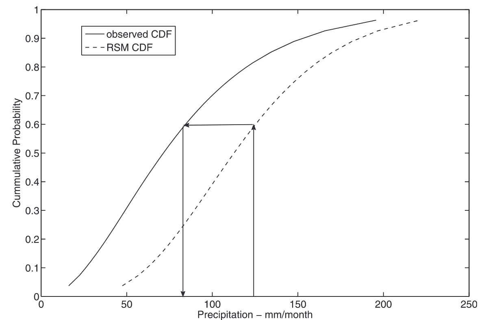

::: {.callout-note}
## Lecture Timeline (45 minutes)

- Motivation and GCM biases (minutes 0-4)
- Weather vs climate distinction + supervised learning (minutes 4-9)
- Delta method (minutes 9-21)
- Quantile delta mapping (QDM) (minutes 21-29)
- QQ-mapping (minutes 29-41)
- Uncertainty and critical considerations (minutes 41-44)
- Wrap-up and looking ahead (minutes 44-45)
:::

## Motivation: Why Bias Correction?

*Minutes 0-4*

Climate models have systematic biases that affect impact assessments.
Even when seasonal totals are correct, the distribution of events matters for impacts.

### Two Types of GCM Biases

The "drizzle bias" is pervasive in GCMs.
They simulate too many light rainfall events with mean intensity too low relative to station observations.
This arises from spatial averaging within grid cells ($\approx 100-300$ km) and sub-grid parameterizations.
Even if total monthly rainfall is correct, this frequency/intensity distortion strongly affects crop growth, soil moisture dynamics, and flood generation.

Dynamical biases are systematic errors in large-scale circulation patterns.
Examples include errors in ENSO amplitude and frequency, monsoon timing, and midlatitude storm tracks.
These affect both climatology and the predictability of interannual variations.

::: {.callout-tip}
## Discussion Question

Pick one impact domain (agriculture, floods, urban drainage, or energy).
Which bias is more damaging in your domain—drizzle bias or dynamical bias—and why?
What observable metrics would you compute to diagnose and quantify the bias?

Suggested format: 2 min pair + 2 min share.
:::

### Weather vs Climate: A Critical Distinction

*Minutes 4-9*

Weather forecasting is an initial value problem.
We have paired observations (forecast-observation pairs from the past) that enable supervised learning.
Standard machine learning methods work well.

::: {.callout-note}
## Note: Rapid progress in supervised downscaling

Supervised learning for weather forecasting/downscaling has seen impressive advances (e.g., diffusion-model approaches like CorrDiff) because we can train on large collections of forecast–observation pairs.
However, training a downscaler for climate change signals (e.g., a climate emulator) is much harder: no paired future data, strong distribution shift and nonstationarity, and the need to respect long-term physical constraints.
Not impossible—this is active research—but higher risk and requires careful validation and uncertainty quantification.
:::

Climate modeling is a boundary value problem.
We have no paired observations for future climate.
We can only compare distributions over the historical period under the same forcing conditions.
This fundamental difference requires different statistical approaches.

When we have paired data (predictand and predictor), we can use supervised learning.

Super-resolution takes coarse-resolution fields as input and produces high-resolution fields as output.
This can be done deterministically (single best estimate) or probabilistically (ensemble of possibilities).

Precipitation modules take other atmospheric fields like temperature, humidity, and winds as inputs and estimate precipitation at finer spatial scales.
These are often trained patch-by-patch, though emerging methods ensure consistency across patches.

Simple bias correction fixes systematic errors in means and variances.
For example, if a weather model is consistently 2°C too warm, we can correct using linear regression on historical forecast-observation pairs.

The key advantage is direct training on paired observations using standard machine learning.

::: {.callout-tip}
## Discussion Question

If a supervised diffusion model like CorrDiff excels at weather-scale downscaling, what specific obstacles arise when trying to train a similar model to downscale future climate projections?
Which of those can you mitigate, and how?

Suggested format: 2 min pair + 2 min share.
:::

### Climate: The Hard Case

For future climate, we have no observations.
We can only train on distributions from the historical period.
The core assumption is that GCM and observations represent the same climate under the same forcings during this period.

We must compare the GCM distribution for the historical period (e.g., 1980-2010) with the observed distribution for the same period.
Then we assume the bias correction transfer function applies to the future.
This is a strong assumption that may fail if the climate system transitions to a new regime.

## Delta Method

*Minutes 9-21*

The delta method is simple but widely used [@hay_comparison:2000].

### Assumption and When to Use

The GCM may have systematic biases in absolute values.
These could arise from radiation parameterization errors, ocean heat transfer, or topographic representation.
However, we assume the change signal is credible.

For example, a model might be 2°C too warm everywhere due to a cloud parameterization error, but it correctly simulates a 3°C warming trend from increased greenhouse gases.
The delta method preserves the change while correcting the bias.

### Mathematical Framework

**Notation:**

- $X^\text{obs}_\text{hist}$ = observed variable in historical period
- $X^\text{GCM}_\text{hist}$ = GCM-simulated variable in historical period
- $X^\text{GCM}_\text{fut}$ = GCM-simulated variable in future period
- $\bar{X}$ = temporal average (e.g., monthly mean)

Compute the change (delta):
$$
\Delta = \bar{X}^\text{GCM}_\text{fut} - \bar{X}^\text{GCM}_\text{hist}
$$

Apply to observations:
$$
X^\text{corr}_\text{fut} = X^\text{obs}_\text{hist} + \Delta
$$

### Variants

For temperature, we typically use an additive delta:
$$
T^\text{corr}(d, m, y) = T^\text{obs}(d, m, y_\text{hist}) + [\bar{T}^\text{GCM}_\text{fut}(m) - \bar{T}^\text{GCM}_\text{hist}(m)]
$$

Here $d$ is the day of month, $m$ is the calendar month, $y$ is the year, and $y_\text{hist}$ is a year from the historical period.
We take a day from the historical record and add the monthly-mean temperature change.

For precipitation, we use a multiplicative delta:
$$
P^\text{corr}(d, m, y) = P^\text{obs}(d, m, y_\text{hist}) \times \frac{\bar{P}^\text{GCM}_\text{fut}(m)}{\bar{P}^\text{GCM}_\text{hist}(m)}
$$

::: {.callout-tip}
## Discussion Question

Why use additive correction for temperature but multiplicative for precipitation?
What would go wrong if you did it the other way?

*Hint: Think about what happens if temperature drops by 5°C vs if precipitation drops by 50%.*
:::

### Example Calculation

Suppose for July we have:

- Observed historical mean: $\bar{T}^\text{obs}_\text{hist} = 25°\text{C}$
- GCM historical mean: $\bar{T}^\text{GCM}_\text{hist} = 27°\text{C}$ (2°C warm bias)
- GCM future mean: $\bar{T}^\text{GCM}_\text{fut} = 30°\text{C}$

The delta is $\Delta = 30 - 27 = 3°\text{C}$.

The corrected future temperature is $T^\text{corr}_\text{fut} = 25 + 3 = 28°\text{C}$.

We preserve the GCM's 3°C warming signal while removing the 2°C warm bias.

### Advantages and Limitations

The delta method is simple, transparent, and preserves the GCM-simulated change signal.
It works for any statistic including means, quantiles, or variances.
We can apply different deltas for different months or seasons.

However, it is deterministic (single-valued correction with no uncertainty representation).
It assumes the bias structure doesn't change with climate.
It doesn't correct frequency or intensity distributions directly, only aggregated statistics.

::: {.callout-tip}
## Discussion Question

The delta method assumes the bias is additive (for temperature) or multiplicative (for precipitation) and constant across climate states.

What physical processes might violate these assumptions?
For example:

1. What if precipitation shifts from frontal to convective?
2. What if cloud feedbacks change with warming?
3. What if the seasonal cycle shifts?

*Think about: process-level changes, nonlinear responses, threshold effects.*
:::

## Quantile Delta Mapping (QDM)

*Minutes 21-29*

QDM blends the strengths of delta change and quantile mapping [@cannon_GCMbc:2015].
It corrects historical bias while preserving the GCM’s projected change at each quantile.
This avoids “erasing” the modeled climate-change signal during bias correction.

### Assumptions and Idea

We assume the quantile relationship between model and observations during the historical period is informative, and that the GCM’s change signal by quantile is credible.
QDM applies quantile mapping on the historical relationship, then adjusts by the modeled change factor at the same quantile.

### Notation

- $F^\text{mod}_\text{hist}$, $F^\text{obs}_\text{hist}$: historical CDFs (model, observed)
- $Q^\text{mod}_\text{hist}(p)$, $Q^\text{mod}_\text{fut}(p)$, $Q^\text{obs}_\text{hist}(p)$: corresponding quantile functions
- For a modeled future value $y_i$ (from the GCM future series), define its modeled future percentile $p_i = F^\text{mod}_\text{fut}(y_i)$

### QDM formula

- Additive variables (e.g., temperature):
$$
x^{\text{QDM}}_{\text{fut}, i} = Q^\text{obs}_\text{hist}(p_i) + \Big[Q^\text{mod}_\text{fut}(p_i) - Q^\text{mod}_\text{hist}(p_i)\Big]
$$

- Multiplicative variables (e.g., precipitation):
$$
x^{\text{QDM}}_{\text{fut}, i} = Q^\text{obs}_\text{hist}(p_i) \times \frac{Q^\text{mod}_\text{fut}(p_i)}{Q^\text{mod}_\text{hist}(p_i)}
$$

Intuition: map the modeled future value to a percentile $p_i$, take the observed historical value at that percentile, and then apply the model’s projected change at that percentile (absolute for temperature, relative for precipitation) [@cannon_GCMbc:2015].

### Pros and caveats

- Preserves modeled change signal across the distribution; mitigates “delta erosion.”
- Handles non-uniform changes (e.g., heavier tails) better than plain delta.
- Still assumes historical quantile relationships carry forward; tail extrapolation remains tricky.
- Requires care for zero-inflation and frequency changes for precipitation.

::: {.callout-tip}
## Discussion Question

When would you prefer QDM over plain QQ-mapping or the basic delta method?
Give one example where preserving quantile-specific change matters for impacts, and one case where QDM’s assumptions might be risky.

Suggested format: 1 min think + 2 min pair + 2 min share.
:::

The delta method is simple but widely used [@hay_comparison:2000].

## Quantile-Quantile (QQ) Mapping

*Minutes 29-41*

QQ-mapping is more sophisticated and directly addresses the drizzle bias [@ines_biascorrection:2006].

### Assumption and When to Use

We assume the GCM captures the physical processes generating precipitation, such as frontal systems and convection, but has systematic errors in the frequency and intensity of individual events.
The relationship between GCM and observed distributions should hold in the future.

This is reasonable if the GCM simulates realistic large-scale dynamics but fails at the sub-grid scale.
It is less reasonable if the GCM completely misses key processes.

### Motivation

Precipitation is the product of frequency and intensity:
$$
\bar{X}_m = \pi_m \times \mu_{I,m}
$$

where $\pi_m$ is the wet-day frequency in calendar month $m$ (dimensionless) and $\mu_{I,m}$ is the mean wet-day intensity in month $m$ (mm/day).

Correcting only the monthly mean $\bar{X}_m$ doesn't fix the frequency/intensity distortion.

::: {.callout-tip}
## Discussion Question

A GCM simulates 20 days with 5 mm/day rain (monthly total = 100 mm).
Observations show 10 days with 10 mm/day rain (also 100 mm total).

If you only correct the monthly mean, what problems might arise for:

1. A soil infiltration model?
2. A crop water stress model?

*Think about: infiltration capacity, runoff generation, dry spell length, water stress timing.*
:::

### Visual Illustration

The two figures below illustrate how QQ-mapping works:

::: {layout-ncol=2}
](qq_mapping_example.png)

:::

### Two-Step Process

**Notation:**

- $P^\text{GCM}(d, m, y)$ = daily GCM precipitation on day $d$ of month $m$ in year $y$
- $P^\text{obs}(d, m, y)$ = daily observed precipitation
- $F(\cdot)$ = cumulative distribution function (CDF)
- $F^{-1}(\cdot)$ = inverse CDF (quantile function)
- $\tilde{x}$ = threshold for defining "wet day" (typically 0.1 mm)

**Step 1: Frequency correction**

Find threshold $\tilde{x}^\text{GCM}$ such that GCM wet-day frequency matches observed:
$$
F^\text{GCM}(\tilde{x}^\text{GCM}) = F^\text{obs}(\tilde{x}^\text{obs})
$$

where $\tilde{x}^\text{obs} = 0.1$ mm is the observed wet-day threshold.

Invert to get:
$$
\tilde{x}^\text{GCM} = (F^\text{GCM})^{-1}\left(F^\text{obs}(\tilde{x}^\text{obs})\right)
$$

Discard all GCM values below $\tilde{x}^\text{GCM}$.
This removes excess drizzle events.

**Step 2: Intensity correction**

For each wet day $i$ with $x_i \geq \tilde{x}^\text{GCM}$, map from GCM intensity distribution to observed:
$$
P^\text{corr}_i = (F^\text{obs}_I)^{-1}\left(F^\text{GCM}_I(P^\text{GCM}_i)\right)
$$

where $F^\text{GCM}_I$ is the CDF of GCM intensities above threshold $\tilde{x}^\text{GCM}$ and $F^\text{obs}_I$ is the CDF of observed intensities above threshold $\tilde{x}^\text{obs}$.

The intuition is to find where $P^\text{GCM}_i$ falls in the GCM distribution, then sample the same percentile from the observed distribution.

### Distribution Choices

For observed intensities ($F^\text{obs}_I$), we typically use a gamma distribution:
$$
f(x; \alpha, \beta) = \frac{1}{\beta^\alpha \Gamma(\alpha)} x^{\alpha-1} \exp\left(-\frac{x}{\beta}\right), \quad x > 0
$$

The shape parameter $\alpha$ is dimensionless and the scale parameter $\beta$ has the same units as $x$.
Both are estimated by maximum likelihood estimation (MLE).

For GCM intensities ($F^\text{GCM}_I$), two approaches are common.
Gamma-Gamma (GG) fits a gamma distribution to both GCM and observed data.
Empirical-Gamma (EG) uses the empirical CDF for GCM data but gamma for observed.
@ines_biascorrection:2006 found EG slightly better for their crop modeling application.

### Why This Matters

Crop and hydrologic models are sensitive to the timing of rainfall events (wet versus dry days), individual event intensities (which determine soil infiltration and runoff generation), and dry spell lengths (which determine water stress).

Correcting only monthly totals can give very different impact predictions than correcting frequency and intensity separately.
@ines_biascorrection:2006 show that even with perfect monthly totals, simulated crop yields can be biased if the daily structure is wrong.

### Limitations

QQ-mapping is still deterministic.
It provides a single-valued mapping from GCM to observed quantiles with no representation of uncertainty.
It assumes the quantile-quantile relationship holds for future climate, which may fail if precipitation-generating mechanisms change.

Critically, standard quantile mapping can unintentionally alter the GCM’s projected climate change signal (inflating or suppressing trends in means and extremes) when applied to future data—one of the central motivations for QDM [@cannon_GCMbc:2015].

Terminology: in the literature, “quantile mapping” (QM) is the common term; “QQ-mapping” is used informally and interchangeably in some communities. Both refer to the same family of methods.

## Uncertainty in Bias Correction

*Minutes 41-43*

Bias correction is not a panacea and introduces additional uncertainty.

### Sources of Uncertainty

Sampling uncertainty arises from the limited length of observational records.
A 30-year calibration period has few extreme events, leading to uncertainty in estimating distribution parameters, especially in the tails.

Structural uncertainty comes from the choice of method (delta versus QQ versus others), the choice of distribution (gamma versus empirical versus others), the choice of temporal aggregation (daily versus monthly), and how to handle wet-day thresholds.

Extrapolation uncertainty asks whether the bias correction transfer function will hold for future climate.
What if the future climate has no historical analog?
New atmospheric circulation patterns, unprecedented temperature/moisture combinations, or changes in precipitation-generating processes could all violate our assumptions.

::: {.callout-tip}
## Discussion Question

Suppose you calibrate QQ-mapping using 1980-2010 data, when the wettest month had 250 mm.
In 2080, the GCM simulates a month with 400 mm.

1. What will QQ-mapping do?
2. What assumptions are you making?
3. When might this fail?

*Think about: extrapolation methods, physical realism, process changes.*
:::

### Methods Can Disagree Strongly

@hay_comparison:2000 compared delta change and statistical downscaling for three US basins.
Both methods used the same GCM outputs but gave markedly different runoff projections.
Differences were largest in mountainous regions with complex terrain.
Neither method was clearly "better" without independent validation data.

::: {.callout-important}
## Bias Correction Can ADD Uncertainty

Applying bias correction doesn't necessarily improve impact predictions.
It transforms one type of uncertainty (GCM bias) into another (correction uncertainty).
Multiple methods should always be compared.
:::

### Quantifying Uncertainty

Best practices include using multiple bias correction methods, using multiple GCMs, generating ensembles to sample uncertainty, and validating on independent data when possible.
However, validation is challenging because we care most about future conditions where no validation data exists.

## Critical Considerations

*Minutes 43-44*

### Extrapolation

Bias correction methods must extrapolate beyond their calibration range.
QQ-mapping often uses constant extrapolation (mapping to the maximum observed value) or linear extrapolation (extending the trend at the tail).
Both can produce unrealistic extremes or violate physical constraints like negative precipitation.

The delta method assumes constant absolute (additive) or relative (multiplicative) bias.
This may be unreasonable if precipitation-generating processes change, such as a shift from frontal to convective precipitation.

Future climate may have no historical analog with new atmospheric circulation patterns, unprecedented temperature/moisture combinations, and changes in precipitation mechanisms.

### Missing Processes

::: {.callout-warning}
## Bias Correction Isn't Magic

You cannot correct for processes the GCM doesn't simulate.
Garbage in, garbage out still applies.
:::

Consider tropical cyclones as an example.
Many global GCMs don't resolve tropical cyclones, which require roughly 50 km horizontal resolution.
Observations clearly show TCs in coastal regions like Houston and Miami, but the GCM shows smooth, large-scale precipitation instead.

What happens with QQ-mapping?
It will create intense rainfall events to match the observed distribution.
However, the timing will be wrong (spread throughout the season versus clustered in actual TC events).
The location will be wrong (GCM has different storm tracks or no organized tracks).
The dynamics will be wrong (no organized rotation, no rapid intensification, no realistic structure).

::: {.callout-tip}
## Discussion Question

Your GCM simulates no tropical cyclones but observations have them.
You apply QQ-mapping for a coastal location.

1. What happens to the bias-corrected rainfall?
2. Is the result useful for impact assessment?
3. What alternatives might you consider?

*Think about: statistical properties versus physical realism, temporal clustering, spatial structure.*
:::

### Credibility Check and Scale Considerations

The GCM must credibly simulate the target variable at some level.
Good uses include correcting drizzle bias when the GCM captures large-scale precipitation patterns, correcting temperature biases when circulation is realistic, and adjusting timing and magnitude when the seasonal cycle is captured.

Poor uses include trying to "fix" completely missing processes, applying corrections where GCM circulation is unrealistic, and extrapolating far beyond historical conditions.

::: {.callout-tip}
## Discussion Question

You're studying flood risk in a monsoon region.
The GCM simulates monsoon onset 2 weeks late and underestimates peak rainfall by 30%.

1. Can bias correction fix these problems?
2. Which aspects can be corrected and which cannot?
3. What diagnostic checks would you perform before trusting the bias-corrected output?

*Think about: timing versus magnitude errors, process representation, validation strategies.*
:::

Sometimes a hierarchical approach is better.
We can bias-correct the GCM at coarse scale for large-scale precipitation, then run a specialized process model like a TC model or convective model, and finally combine outputs for local impacts.
This preserves GCM information where it is credible while using process models for sub-grid phenomena.

## Looking Ahead

*Minutes 44-45*

### Beyond Basic Methods

The delta method and QQ-mapping are starting points.
More sophisticated methods exist and will be covered later in the course.

Stochastic weather generators can generate multiple realizations conditioned on GCM output.
They represent sub-monthly variability and uncertainty naturally.
We will cover these later in Module 2.

Weather typing and hidden Markov models classify GCM output into discrete weather states and link states to local precipitation distributions.
These are naturally probabilistic and will be covered in the next two weeks.

Multivariate bias correction corrects multiple variables simultaneously while preserving correlations like temperature-precipitation relationships.
This remains an active research area.

Spatial consistency is challenging because basic QQ-mapping is univariate (one location at a time) and can destroy the spatial coherence of precipitation fields.
Emerging methods include rank-based approaches and optimal transport.

### Preparing for Wednesday

On Wednesday we will discuss @ines_biascorrection:2006 in detail.

Key questions to consider while reading:

1. How well does the bias correction improve crop yield simulations?
2. What limitations remain even after bias correction?
3. Why do yields remain under-predicted even with "perfect" rainfall distributions?

The paper provides a concrete case study of the methods we discussed today and highlights remaining challenges.

### Preparing for Lab 7

Friday's lab will implement bias correction methods in Julia.

You will apply the delta method for temperature, QQ-mapping for precipitation, and compare results for a case study basin.
This hands-on implementation will solidify your understanding of the mathematical details and practical considerations.

## References

::: {#refs}
:::
