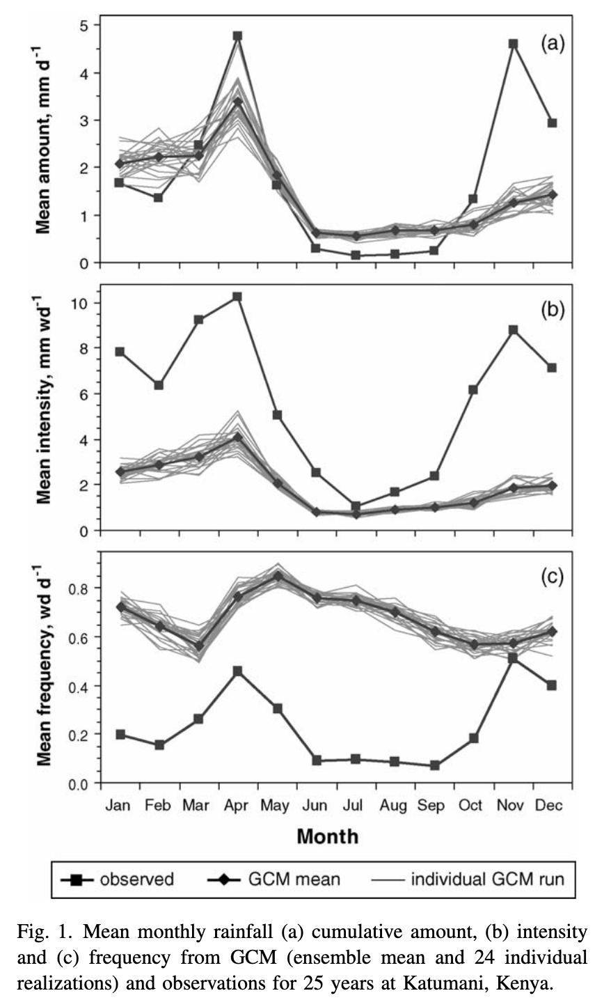
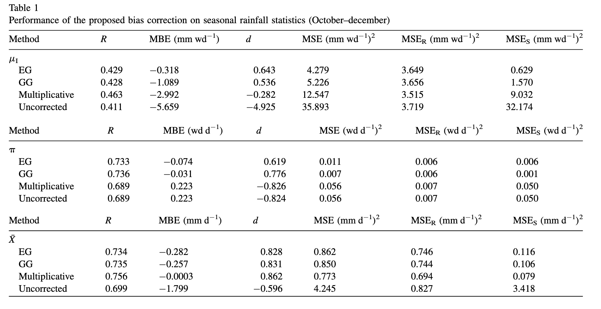
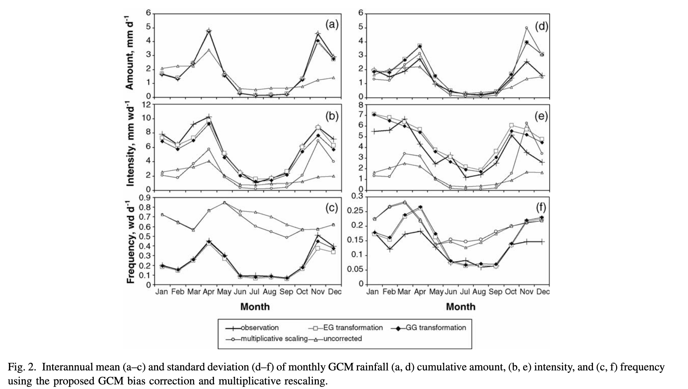
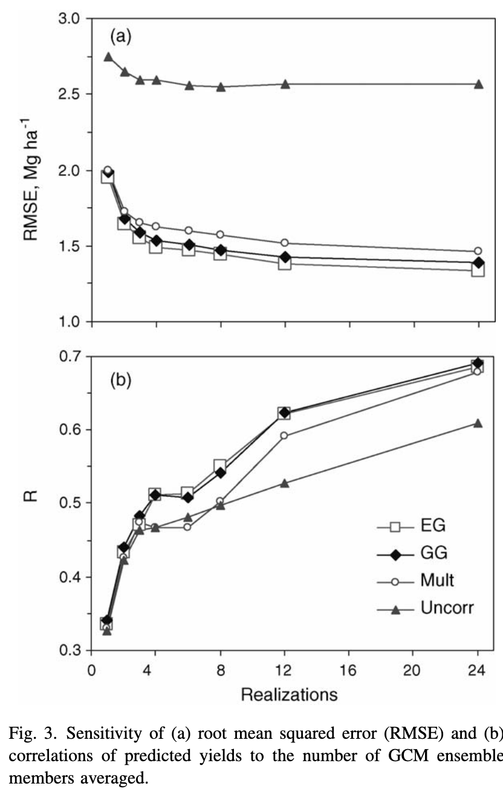
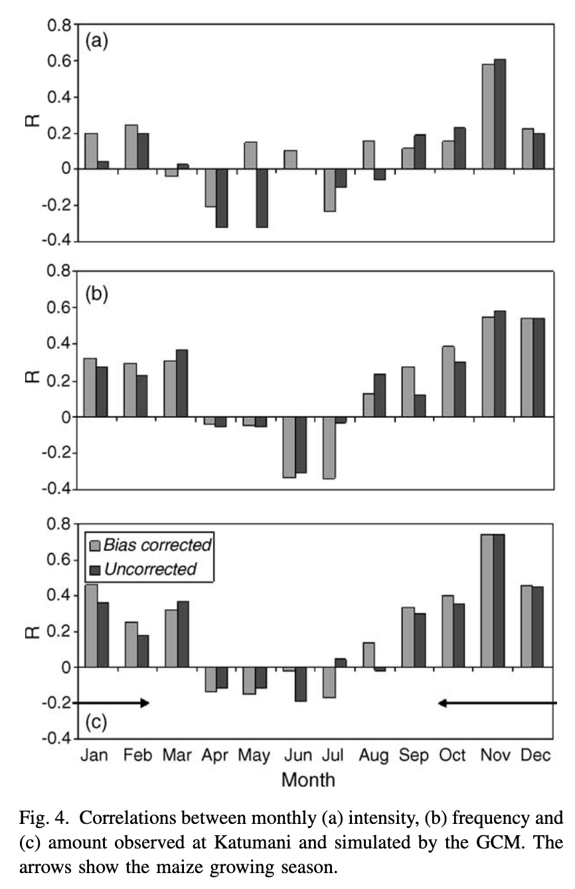
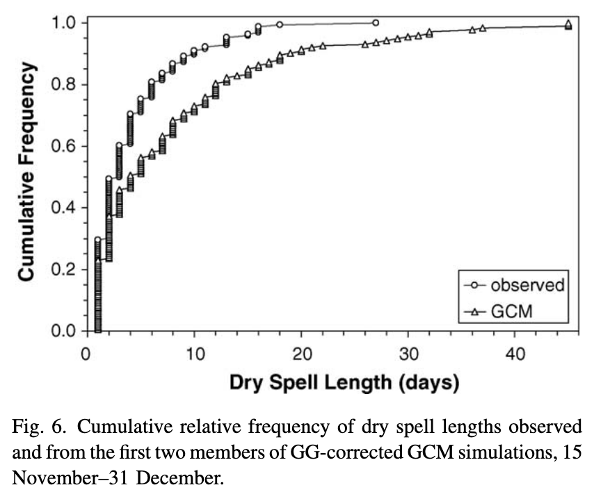
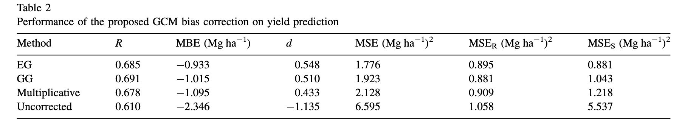
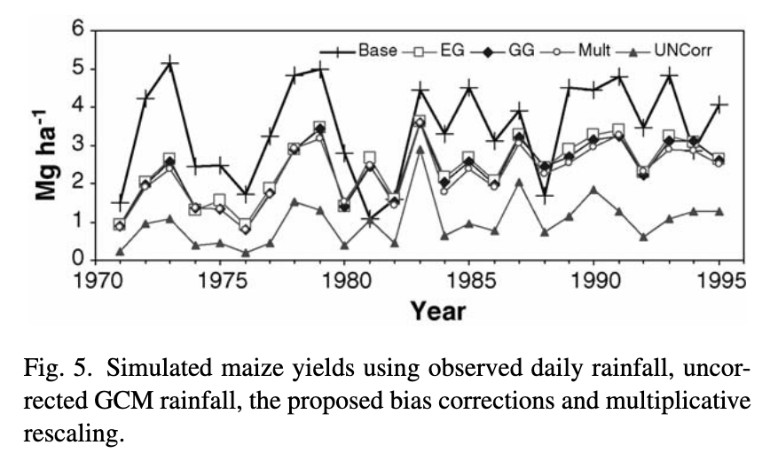

## Today's Paper

@ines_biascorrection:2006:

::: {#refs}
:::

::: {.notes}
See [notes and answers](https://docs.google.com/document/d/1uhmHczIGhp2demFje6QBB6ij6Yh6pMFBHz6YTyNBzM0/edit?tab=t.0) -- JDG only, don't ask for access
:::

# Part 1: Basic Warmup — The Setup

---

**Q1:** What is the "drizzle bias" (the typical distortion) observed in daily GCM rainfall when compared to station-level observations?

---

::: {.columns}
::: {.column width="40%"}

:::
::: {.column width="60%"}
**Q2:** Looking at Fig. 1(b) and 1(c), how does the "GCM mean" (diamonds) visually compare to the "observed" (squares) for mean intensity and mean frequency?
:::
:::

---

**Q3:** What crop simulation model was used, and what was the "observed truth" used to evaluate the yield simulations?

---

**Q4:** The authors propose a two-step bias correction.
What two statistical properties of daily rainfall does this procedure adjust?

---

**Q5:** What statistical property does the simpler "Multiplicative Shift" (MS) procedure correct, and what properties does it ignore?

---

**Q6:** Why is correcting daily rainfall frequency and intensity critical for a non-linear impact model (like a crop model)?

---

**Q7:** What was the strategic purpose of "neutralizing" the effect of temperature and solar radiation by using their long-term monthly means?

---

**Q8:** What is the purpose of running simulations with an ensemble (multiple GCM realizations) and then averaging the resulting yields?

# Part 2: Understanding the Results — Correcting the Rain

---

**Q9:** What does Table 1 (Mean Bias Error) show about the performance of the EG and GG methods?

---

**Q10:** How does the probability density function (PDF) in Fig. 2 visually represent the drizzle bias?

---

::: {.columns}
::: {.column width="50%"}

:::
::: {.column width="50%"}
**Q11:** In the Quantile-Quantile plot (Fig. 3), what does it mean that the GCM plot (triangles) is consistently below the 1:1 line?
:::
:::

---

::: {.columns}
::: {.column width="50%"}

:::
::: {.column width="50%"}
**Q12:** How does Fig. 4 demonstrate the GCM's limited skill (correlation) in predicting the timing of monthly rainfall?
:::
:::

---

**Q13:** After fixing mean rainfall, frequency, and intensity, a significant yield bias remained.
What uncorrected, higher-order GCM bias was the likely cause?

---

**Q14:** How does Fig. 6 visually demonstrate the GCM's bias in dry spell lengths?

# Part 3: Deeper Questions — Yields & Implications

---

**Q15:** According to Table 2, how well did the uncorrected GCM rainfall ("Uncorr") perform in simulating yields?

---

::: {.columns}
::: {.column width="65%"}

:::
::: {.column width="35%"}
**Q16:** Looking at Fig. 5 and Table 2, how did the bias-corrected methods (EG, GG, Mult) change the simulated yield time series?
:::
:::

---

**Q17:** Why was it "surprising" that the "Simple" Multiplicative Shift (MS) method performed nearly as well as the complex two-step method in improving yield skill (correlation)?

---

**Q18:** What is the ultimate limitation of using this (or any) bias-corrected GCM for practical seasonal forecasting?

---

**Q19:** For a flood study (sensitive to extremes), why might the EG (Empirical-Gamma) method be a more robust choice than the GG (Gamma-Gamma) method?

