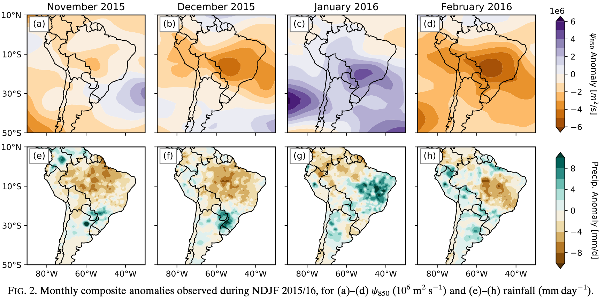
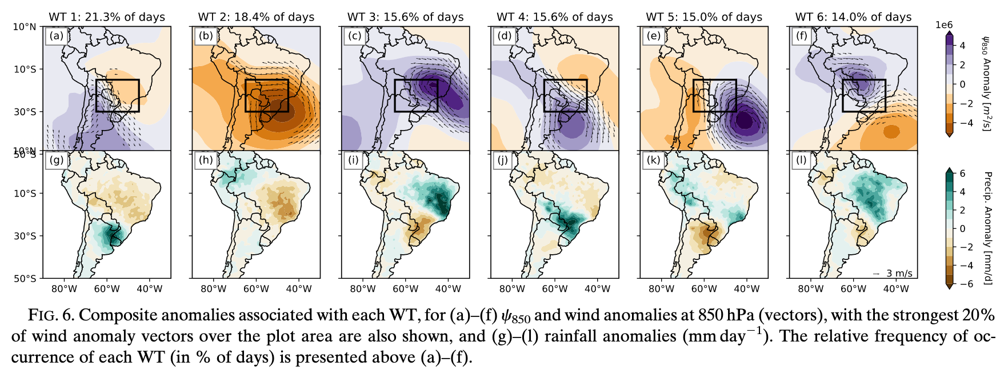
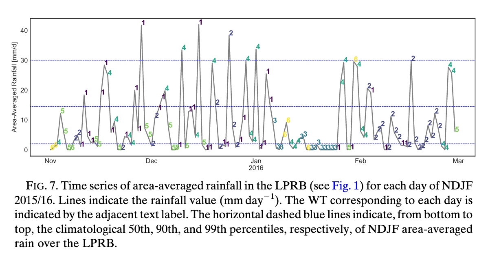
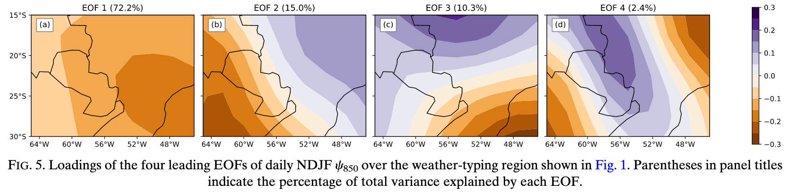

## Today's Paper

@doss-gollin_pyfloods:2018

::: {#refs}
:::

::: {.notes}
See [notes and answers](https://docs.google.com/document/d/TBD/edit?tab=t.0) -- JDG only, don't ask for access
:::

# Part 1: Figure Understanding — Warm-up & Context

---

**Q1:** What was the large-scale climate picture during this period?

---

**Q2:** The authors explain this flood event through specific weather patterns called Weather Types (WTs).
Looking at Fig. 6, what two fields are shown for each of the 6 weather types?
Why are these appropriate choices?

---

**Q3:** Pick WT1 from Fig. 6 and describe it.
What kind of circulation pattern does it show?
Where does it rain?
Where is the moisture coming from?

---

**Q4:** Now contrast WT1 with WT4 in Fig. 6.
How do these two patterns differ in terms of circulation, precipitation, and moisture transport?

---

**Q5:** Which weather type(s) in Fig. 6 would you expect to be associated with heavy rainfall in the Lower Paraguay River Basin?
What about dry conditions?

---

**Q6:** Looking at the colored bars in Fig. 7 for the 2015/16 summer, what do you notice about the frequency of different weather types?
How does this explain the flood?

# Part 2: Basic Methods Questions

---

**Q7:** Before applying K-means clustering, the authors perform an EOF (PCA) analysis on the streamfunction anomaly field.
Looking at Fig. 5, why did they do this EOF analysis rather than cluster the raw streamfunction maps directly?

---

**Q8:** The clustering pipeline works as follows:

1. Calculate EOFs/PCs from $\psi'$
1. Cluster the daily PC time series into $K$ groups
1. Composite the weather for all days in each group to create Fig. 6.

Before clustering, the authors scale the retained PCs to unit variance.
Why do they do this?
What would happen if they didn't scale the PCs?

---

**Q9:** The authors chose $K=6$ clusters, which they acknowledge is a subjective choice.
They tested $K=4$ through $K=8$ and settled on $K=6$ for "physical interpretability and distinctness."

What is the trade-off between choosing too few clusters (e.g., $K=4$) versus too many clusters (e.g., $K=8$)?

# Part 3: Deeper Methods & Interpretation

---

**Q10:** $K$-means is a "hard" classification method.
Looking at Fig. 7, what does this mean for any given day?
What are the limitations of this approach, given that atmospheric flow is continuous and transitions smoothly from one state to another?

---

**Q11:** How does "forcing" days into discrete boxes affect the composite results shown in Fig. 6?
Think about what happens when you include days that are "borderline" between two weather types.

---

**Q12:** Suppose you have a climate model that simulates 850-hPa streamfunction ($\psi'$).
How could you use these 6 weather types (Fig. 6) to bias correct the model's precipitation?
What is the very first step you would need to take with the model's $\psi'$ output?

---

**Q13:** How would you correct the frequency bias?
For example, if the model produces too many WT5 (dry) days and not enough WT1 (wet) days, what could you do?

---

**Q14:** What biases would this weather-type-based bias correction method successfully address?

---

**Q15:** What biases would this method miss or fail to correct?
Think about physical errors within a weather type, local-scale processes not captured by large-scale circulation, and unrealistic model states.
