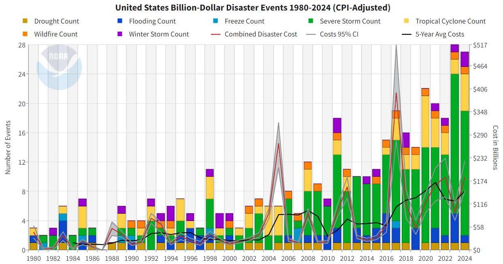
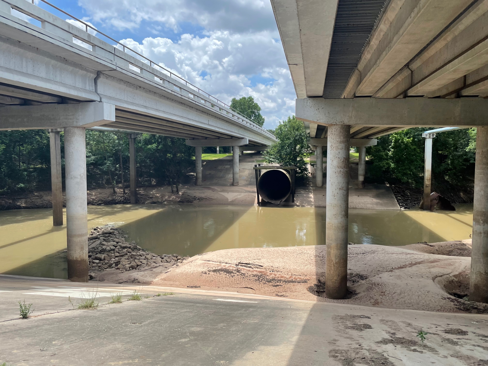
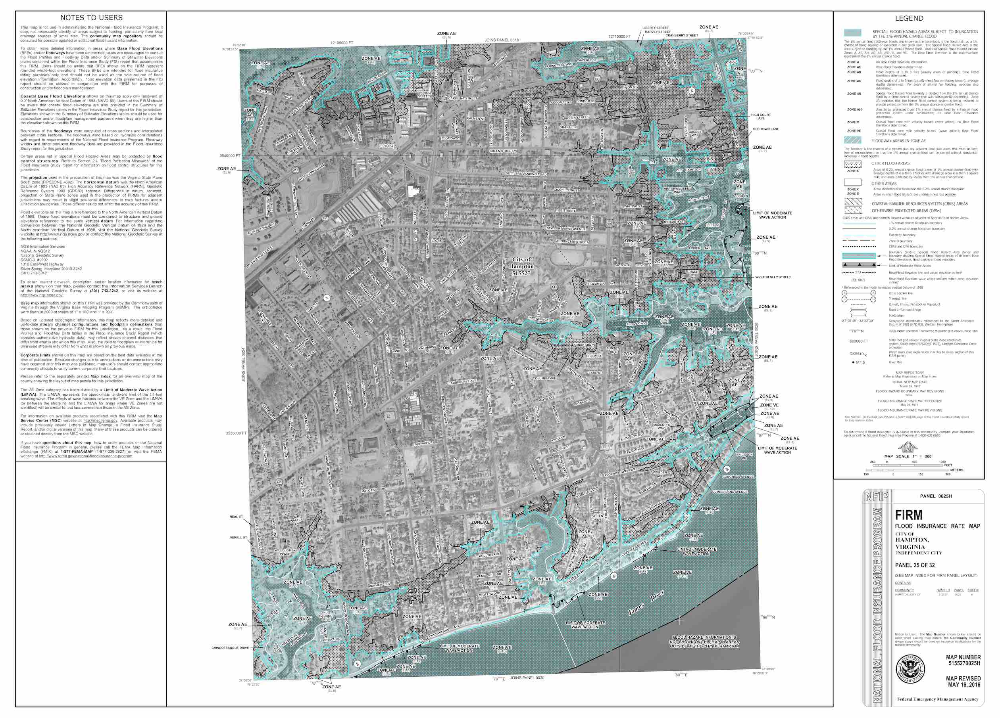
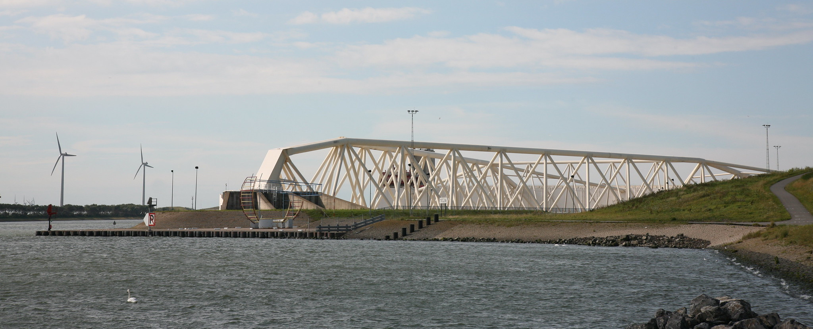
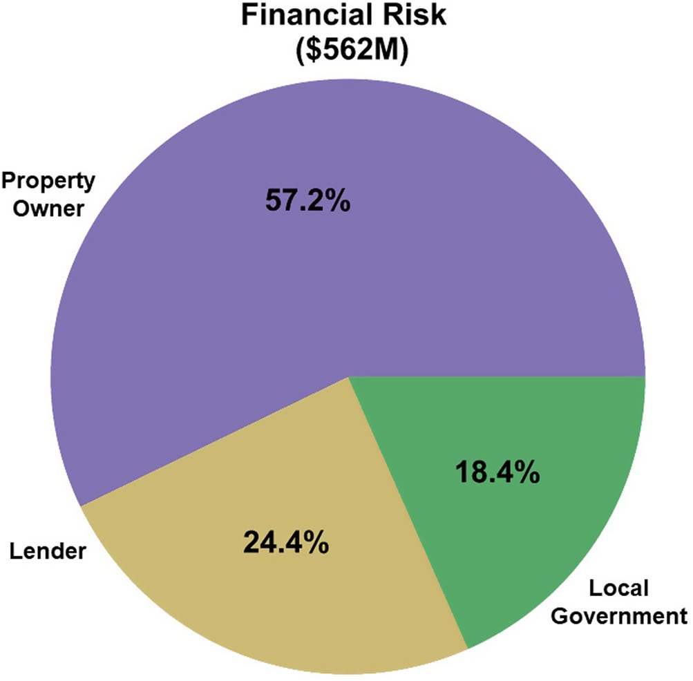

## Billion-dollar disasters, 1980 to 2024

{height=90%}

## Who you are

- Name
- Field of study
- One thing you want to learn

# Example questions

## How big does this culvert need to be?

{height=90%}

## Where is the floodplain?

{height=90%}

## How high should this surge gate be?

{height=90%}

## What premium to charge?

{width=100%}

A parametric catastrophe bond is an insurance policy that pays out based on specified weather-related triggers, not on damages.

## Will these thirty-year mortgages be repaid?

::: {.columns}
::: {.column width="45%"}

{width=100%}

:::
::: {.column width="55%"}

When property owners experience uninsured damages that exceed the equity on their house, lenders and local governments can lose money.

The financial sector is just starting to grapple with *physical risk* [@condon_myopia:2021]

:::
:::

## How to combine green/gray infrastructure across a city?

::: {.callout-note appearance="simple"}
Figure shown in class: A permeable park in a Chinese sponge city, built to hold and infiltrate stormwater instead of piping it away (Mu Yu/Xinhua via Getty Images)
:::

## Key insight

With *probabilistic* estimates of hydroclimate hazard, *and associated uncertainties / limitations*, we can support decisions across sectors and scales.

# Fundamental limitations

## How to analyze records with few extremes?

::: {.callout-note appearance="simple"}
Figure shown in class: Historical major hurricane tracks near Tallahassee beside stochastic tracks from the same coastal box [@neubergerberman_catmod101:2025]
:::

## How do we leverage evolving AI methods?

![Lagged historical initial conditions are perturbed, run through a machine-learning weather model, and turned into simulated precipitation and temperature [@ashcroft_aiensembles:2026, fig. 1]](ashcroft-2026-fig01.png){width=100%}

## How would we know if it is right?


