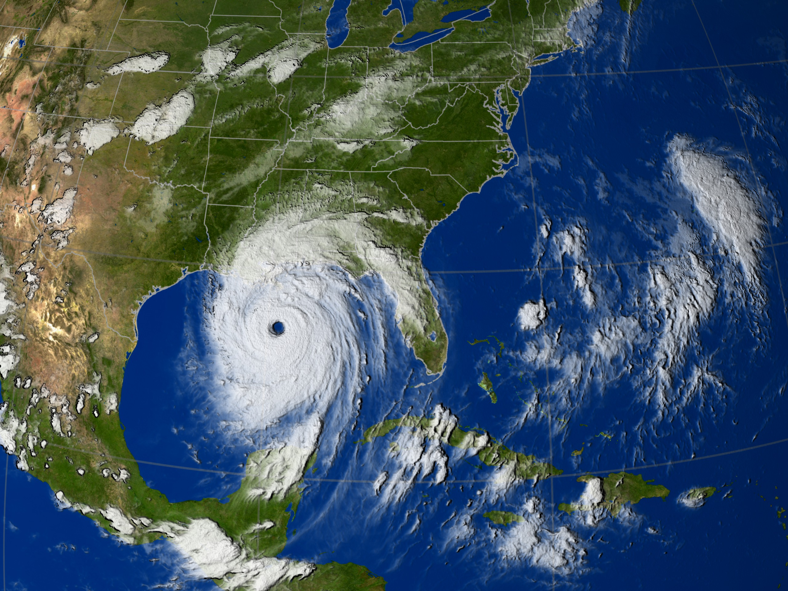
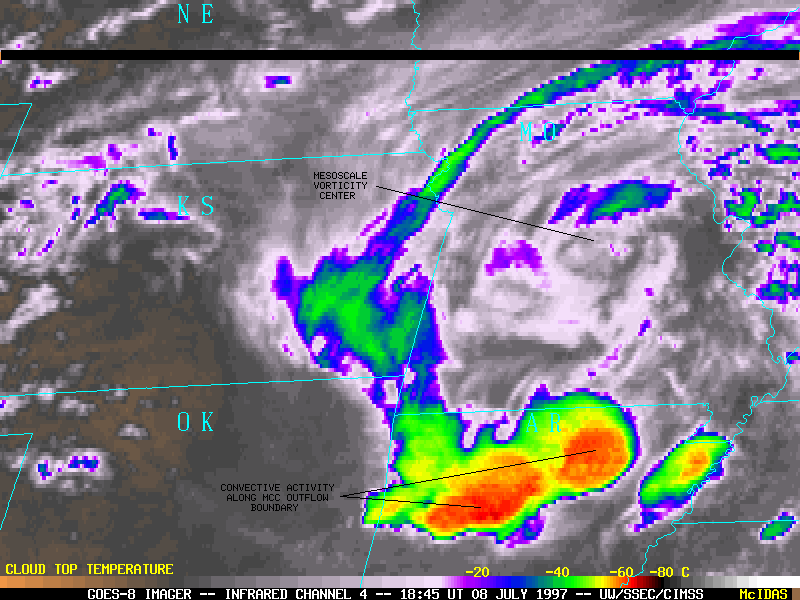
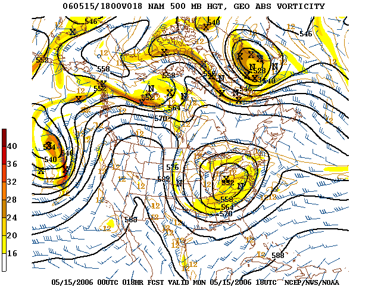
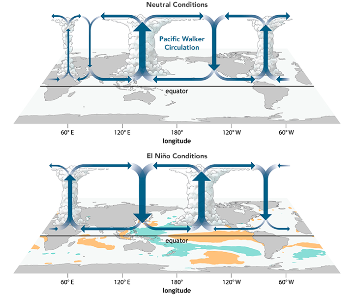
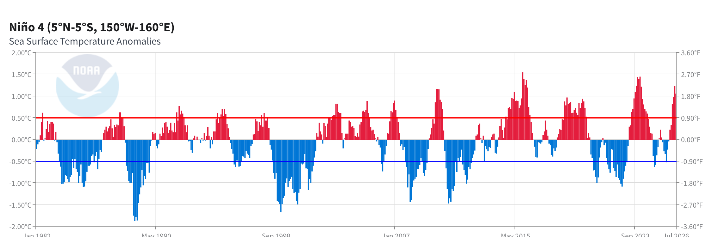
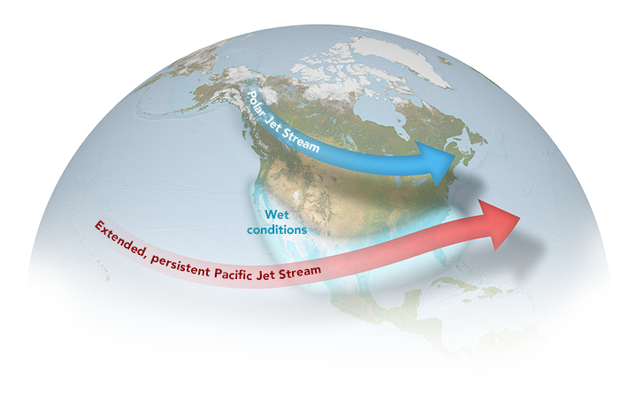
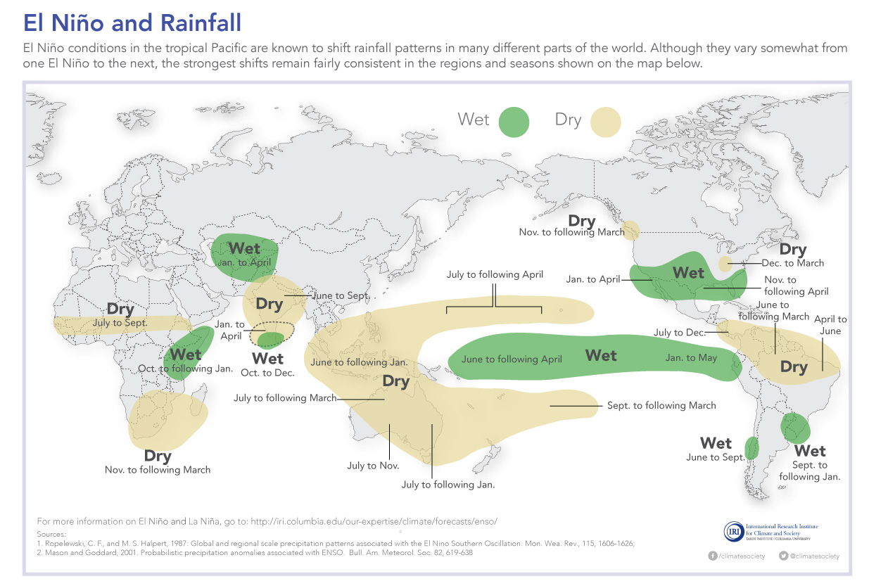

## Have you taken a class on climate?



## Context

**Last Week:** Independent and identically distributed (IID)

**This Week:** Why and how the climate system violates these assumptions

# Exploratory Data Analysis

## Multi-scale variability

![American River at Folsom, California [@doss-gollin_robustadaptation:2019]](doss-gollin_robustadaptation_2019.png){height=90%}

## What do you see?



## 1300 years of Nile annual minima

![Nile annual minima, 622-1921 AD [@ghil_extremes:2011, Fig. 1]](ghil-2011-fig1-nile.png){height=80%}

## Climate risks cluster in time

::: {.callout-note appearance="simple"}
Figure shown in class: North American megadroughts over the past 1200 years [@cook_megadroughts:2010]
:::

## Climate risks cluster in space

![Yearly count of 30-day extreme rainfall exceedances across 40 mining assets, compared to the count expected under independence [@bonnafous_waterrisk:2017]](bonnafous-lall-2017-clustering.png){height=90%}

## How do we describe this?

- Clustering
- Persistence
- Memory
- Regimes

**Not** IID

# The climate system

## Reservoirs, fluxes, and feedbacks

::: {.callout-note appearance="simple"}
Figure shown in class: The climate system (IPCC TAR, Ch. 1, Fig. 1.1)
:::

## Modelling the climate system

::: {.callout-note appearance="simple"}
Figure shown in class: Coupled climate model schematic (NOAA GFDL)
:::

## A fluid on a rotating sphere

::: {.callout-note appearance="simple"}
Figure shown in class: Equations of motion for a fluid on a rotating sphere [@vallis_textbook:2006]
:::

## Weather versus climate

::: {.columns}
::: {.column width="50%"}
#### Weather

- we can make (and verify!) *forecasts*
- Initial value problem
:::
::: {.column width="50%"}
#### Climate

- "the statistics of weather"
- we can make, but not verify, *projections*
- Boundary value problem
:::
:::

# What weather patterns generate extremes

## Atmospheric rivers

::: {.callout-note appearance="simple"}
Figure shown in class: Atmospheric river moisture transport [@gimeno_review:2014]
:::

## Tropical cyclones

{height=90%}

## Mesoscale convective systems

{height=90%}

## Blocking

{height=90%}

# El Niño-Southern Oscillation (ENSO) as a case study

## The Walker circulation

{height=90%}

## El Niño versus La Niña

{height=90%}

## Right now

{height=80%}

## Impacts on the jet stream

{height=80%}

## El Niño and rainfall

{height=90%}

## The mechanism

::: {.columns}
::: {.column width="45%"}

The Bjerknes feedback: warm sea surface temperatures (SSTs) weaken the trade winds, which deepens the thermocline (the warm-cold boundary) in the east, which warms SSTs further [@vialard_rechargeoscillator:2025, p. 4].

The recharge oscillator captures this as a four-phase cycle.

:::
::: {.column width="55%"}

![Recharge oscillator [@vialard_rechargeoscillator:2025, Fig. 7]](vialard-2025-fig7-cycle.png){width=100%}

:::
:::

## Other modes of variability

| Mode | Timescale | Region |
| :--- | :--- | :--- |
| Madden-Julian Oscillation | 30-60 days | Tropics, modulates ENSO onset |
| ENSO | 2-7 years | Tropical Pacific, global reach |
| North Atlantic Oscillation | Weeks to decades | North Atlantic, European weather |
| Pacific Decadal Oscillation | 20-30 years | North Pacific, modulates ENSO |
| Atlantic Multidecadal Oscillation | 60-80 years | North Atlantic, hurricane activity |

## Discussion

- What does multi-scale variability mean for hazard analysis based on a 50-year record?
- Can we use observations to relate ENSO phase to local extremes?
