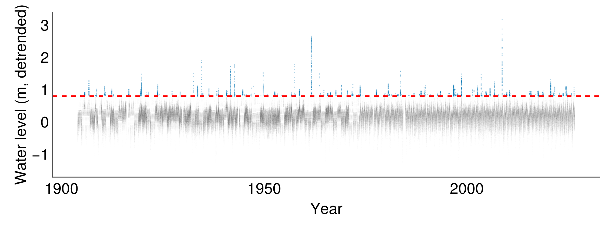

```{julia}
#| echo: false
#| output: false
using CEVE543Utils
using CairoMakie, CSV, DataFrames, Dates, Distributions, LaTeXStrings, Printf, Statistics, Unitful

set_theme!(theme_minimal(); fontsize=20)
colors = Makie.wong_colors()
here = @__DIR__

# --- Coles daily rainfall (Extremes.jl "rain" dataset, Coles 2001 §4.4.1) ---
rain = CSV.read(joinpath(here, "coles-rain.csv"), DataFrame).Rainfall

# --- Galveston Pier 21, hourly, detrended by annual MSL ---
gv = load_water_level(
    "8771450";
    name="Galveston Pier 21",
    cache=joinpath(here, "8771450-hourly.csv"),
    first_year=1904,
)
gv_levels_raw = [ustrip(uconvert(u"m", r.level)) for r in gv]
gv_times = [r.time for r in gv]
gv_years = year.(gv_times)
yearly_mean = Dict(yr => mean(gv_levels_raw[gv_years .== yr]) for yr in unique(gv_years))
ref_level = mean(yearly_mean[yr] for yr in (maximum(gv_years)-4):maximum(gv_years))
gv_levels = [gv_levels_raw[i] - yearly_mean[gv_years[i]] + ref_level for i in eachindex(gv_levels_raw)]
```

## Hourly water levels at Galveston, TX

```{julia}
#| echo: false
#| output: false
gv_threshold = 0.8
gv_frac_year = [year(t) + dayofyear(t) / 366 for t in gv_times]
exceed_idx = findall(>(gv_threshold), gv_levels)

fig = Figure(; size=(800, 300))
ax = Axis(fig[1, 1]; xlabel="Year", ylabel="Water level (m, detrended)")
scatter!(ax, gv_frac_year, gv_levels; color=(:gray, 0.02), markersize=1)
scatter!(ax, gv_frac_year[exceed_idx], gv_levels[exceed_idx]; color=(colors[1], 0.3), markersize=2)
hlines!(ax, [gv_threshold]; color=:red, linestyle=:dash, linewidth=2)
save(joinpath(here, "hourly-threshold.png"), fig; px_per_unit=3)
```



- Galveston Pier 21
- 120 years of hourly readings (detrended by annual mean sea level).

## One way to decluster: the gap rule

1. Group consecutive exceedances into **clusters**: a new cluster starts when the gauge has been below the threshold for at least $r$ hours.
1. Keep only the **maximum** of each cluster.

Here $r = 72$ (three days).

## After declustering

```{julia}
#| echo: false
gv_peak_idx, gv_excesses = decluster(gv_times, gv_levels, gv_threshold)
gv_peak_levels = gv_levels[gv_peak_idx]

fig = Figure(; size=(800, 300))
ax = Axis(fig[1, 1]; xlabel="Year", ylabel="Water level (m, detrended)")
scatter!(ax, [year(gv_times[i]) + dayofyear(gv_times[i]) / 366 for i in gv_peak_idx], gv_peak_levels; color=colors[1], markersize=6)
hlines!(ax, [gv_threshold]; color=:red, linestyle=:dash, linewidth=2)
fig
```

The GPD parameters and the Poisson rate move in opposite directions when the threshold or gap parameter changes, so the return level is approximately insensitive to these choices.

## Choosing a threshold

We picked 0.8 m, but why not 0.5 or 1.2?

- **Too low:** the GPD is an asymptotic approximation, and it gets worse far from the tail. More data, but more bias.
- **Too high:** fewer exceedances, so the parameter estimates are noisier. Less bias, but more variance.

We want the **lowest threshold where the GPD holds**.
Two diagnostic tools help us check.

We will look at each on the textbook example first, then on Galveston.

## The Coles rainfall data

17,531 daily rainfall totals from a single station (Coles, 2001, §4.4.1).
Also documented in `Extremes.jl` tutorial.

```{julia}
#| echo: false
fig = Figure(; size=(800, 250))
ax = Axis(fig[1, 1]; xlabel="Rainfall (mm)", ylabel="Count")
hist!(ax, rain[rain .> 0]; bins=80, color=(colors[1], 0.6))
fig
```

## Mean residual life plot

At each candidate threshold $u$, compute the average excess

$$\hat{E}[X - u \mid X > u]$$

and plot it against $u$.
If the GPD holds above $u_0$, the mean excess is linear in $u$ for $u > u_0$.

```{julia}
#| echo: false
mrl_plot(rain[rain .> 0]; lo_quantile=0.0, hi_quantile=1)
```

Roughly linear from about 30 mm onward, until it gets "too large" to have much data.

## Mean residual life: Galveston

```{julia}
#| echo: false
mrl_plot(gv_peak_levels; lo_quantile=0.01, hi_quantile=0.995)
```

Less clear.
Coles: MRL plots "can be difficult to interpret in practice" (p. 79).

## Parameter stability: what we are plotting

Fit the GPD at each candidate threshold:

- If the GPD holds above $u_0$, the shape $\xi$ should be constant for all $u > u_0$.
- The scale $\sigma_u$ changes with $u$, so we plot the reparameterized $\sigma^* = \sigma_u - \xi u$, which should also be constant.

## Parameter stability: rainfall

```{julia}
#| echo: false
stability_plot(rain[rain .> 0]; lo_quantile=0.0, hi_quantile=0.999)
```

Both $\sigma^*$ and $\xi$ are stable from about 30 mm onward.
Coles fits at $u = 30$ and gets $\hat\sigma = 7.44$, $\hat\xi = 0.184$ with 152 exceedances.

## Parameter stability: Galveston

```{julia}
#| echo: false
stability_plot(gv_peak_levels; lo_quantile=0.01, hi_quantile=0.95)
```

$\xi$ looks stable from about 1.1 m onward.
Messier than the rainfall case, but a defensible choice.

## Fitting and comparing: Galveston

```{julia}
#| echo: false
gv_chosen_u = 1.1
gv_peak_idx_11, gv_exc_11 = decluster(gv_times, gv_levels, gv_chosen_u)
gv_fit = gpfit(gv_levels[gv_peak_idx_11], gv_chosen_u)
gv_gp = only(getdistribution(gv_fit))
gv_sigma, gv_xi = scale(gv_gp), shape(gv_gp)
gv_n_years = year(gv_times[end]) - year(gv_times[1]) + 1
gv_lambda = length(gv_exc_11) / gv_n_years

@printf("Threshold: %.1f m\n", gv_chosen_u)
@printf("Cluster maxima: %d over %d years (λ = %.2f/yr)\n", length(gv_exc_11), gv_n_years, gv_lambda)
@printf("GPD fit: σ = %.3f, ξ = %.3f\n", gv_sigma, gv_xi)
```

## Return levels: three estimates

```{julia}
#| echo: false
return_periods = exp.(range(log(1.5), log(500); length=60))

rl_11 = [pot_return_level(T, gv_chosen_u, gv_sigma, gv_xi, gv_lambda) for T in return_periods]

# GPD at lower threshold (0.8 m)
peak_idx_08, exc_08 = decluster(gv_times, gv_levels, 0.8)
fit_08 = gpfit(gv_levels[peak_idx_08], 0.8)
gp_08 = only(getdistribution(fit_08))
lambda_08 = length(exc_08) / gv_n_years
rl_08 = [pot_return_level(T, 0.8, scale(gp_08), shape(gp_08), lambda_08) for T in return_periods]

# GEV on annual maxima with the same detrending
annmax_detrended = AnnMaxRecord(gv; detrend=:msl, units=u"m")
y_am = ustrip.(waterlevels(annmax_detrended))
gev_fit = only(getdistribution(gevfit(y_am)))
rl_gev = [quantile(gev_fit, 1 - 1 / T) for T in return_periods]

# Empirical return periods from ALL cluster maxima (u = 0.8 m):
# for each storm, annual exceedance rate = rank / n_years
all_peaks_08 = sort(gv_levels[peak_idx_08]; rev=true)
emp_T_08 = gv_n_years ./ (1:length(all_peaks_08))

fig = Figure(; size=(800, 400))
ax = Axis(fig[1, 1]; ylabel="Return level (m, detrended)")
lines!(ax, return_periods, rl_gev; color=colors[3], linewidth=2, label="GEV (annual maxima)")
lines!(ax, return_periods, rl_08; color=colors[2], linewidth=2, linestyle=:dash, label="GPD (u = 0.8 m)")
lines!(ax, return_periods, rl_11; color=colors[1], linewidth=2.5, label="GPD (u = 1.1 m)")
scatter!(ax, emp_T_08, all_peaks_08; color=(:black, 0.4), markersize=4, label="all storms (u = 0.8 m)")
return_period_axis!(ax)
axislegend(ax; position=:lt)
fig
```

Three estimates of the same return level curve, from the same detrended record.
The empirical points are every declustered storm above 0.8 m, plotted at $T = N_{\text{years}} / \text{rank}$.
The two GPD fits and the GEV agree at moderate return periods and diverge in the tail.
